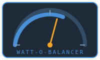

# Watt-O-Balancer

Watt-O-Balancer — Home Assistant EV Charger Load Balancing (HACS-compatible)

  

Smart, local, open-source load balancing for EV chargers integrated with Home Assistant. Watt-O-Balancer dynamically allocates available household power across one or more EV chargers so multiple vehicles can charge fairly without tripping main breakers or exceeding a configured household limit.

**Quick links**
- Features: Fair dynamic power allocation, dynamic rebalancing, integration with existing charger entities, HACS-compatible.
- Installation: HACS (recommended) or manual.
- License: Apache 2.0

---

> ⚠️ **DISCLAIMER — Use at your own risk.**
>
> This integration is provided **as-is**, without any warranty of any kind, express or implied. It is a software load balancer, not a replacement for proper electrical protection (breakers, fuses, RCDs). You are solely responsible for any consequences that result from its use.
>
> You are free to **review, test, and audit** the source code before using it. Contributions, bug reports, and security disclosures are welcome.

---

## What it does

The integration watches your home's power meter. When total household consumption changes, it instantly recalculates how much current your EV charger can safely use without tripping your main breaker. If load goes up, charger current goes down — **immediately**. If load goes down, charger current goes back up — after a short cooldown to prevent oscillation.

**Key features:**
- **Automatic load balancing** — adjusts charger current in real time based on your power meter
- **Safety-first** — reductions are instant; default behavior stops charging if the meter goes offline
- **No YAML required** — configure entirely through the Home Assistant UI
- **Hardware-agnostic** — works with any charger controllable via HA scripts (OCPP, Modbus, REST, etc.)
- **Full observability** — sensors, events, and persistent notifications for monitoring and automations

**Current limitation:** Supports **one charger** per instance. Multi-charger support is planned for [Phase 2](docs/documentation/milestones/02-2026-02-19-multi-charger-plan.md).

---

## 📖 Documentation

| Guide | Description |
|---|---|
| [**Installation & Setup**](docs/documentation/installation-and-setup.md) | Install via HACS, configure step-by-step, verify your setup |
| [**How It Works**](docs/documentation/how-it-works.md) | What to expect, what NOT to expect, entities reference, algorithm details |
| [**Troubleshooting & Debugging**](docs/documentation/troubleshooting-and-debugging.md) | Common problems, log interpretation, diagnostic sensors, FAQ |
| [**Development Guide**](docs/documentation/development-guide.md) | Architecture, running tests/CI locally, contributing, roadmap |

### Reference guides

| Guide | Description |
|---|---|
| [Action Scripts Guide](docs/documentation/action-scripts-guide.md) | Charger control scripts — OCPP, REST, Modbus, switch examples |
| [Event Notifications Guide](docs/documentation/event-notifications-guide.md) | Event types, payloads, automation examples for mobile alerts |
| [Logging Guide](docs/documentation/logging-guide.md) | Debug logs, log levels, diagnostic sensors |

---

## Quick install (HACS)

1. **Install** via [HACS](https://hacs.xyz/) — see [Installation & Setup](docs/documentation/installation-and-setup.md)
2. **Configure** in Settings → Devices & Services → Add Integration → "Watt-O-Balancer"
3. **Create action scripts** to control your charger — see [Action Scripts Guide](docs/documentation/action-scripts-guide.md)
4. **Monitor** via dashboard sensors and [event notifications](docs/documentation/event-notifications-guide.md)

---

## Manual install (developer / local)

1. Copy the `ev_lb` integration folder into `custom_components/ev_lb/` (the current integration domain; a future release may rename this to `watt_o_balancer`).
2. Restart Home Assistant.
3. Configure via the integration UI.

---

## Example configuration (concept)

Configuration is exposed through the integration UI. Conceptually, you will:
- Select charger entities (EV chargers or smart-plugs)
- Provide a household maximum power limit (W)
- Optional priorities or exclusion lists per charger

---

## Goals

- Keep charging within household limits
- Distribute power fairly across concurrent sessions
- Work locally, with minimal cloud dependency
- Play nice with Home Assistant ecosystems and HACS

---

## Contributing

See the [Development Guide](docs/documentation/development-guide.md) for architecture, testing, CI checks, and contribution guidelines.

Development artifacts (research, design decisions, PR retrospectives) are under [`docs/development-memories/`](docs/development-memories/README.md).

---

## License

Apache 2.0 — see the [LICENSE](LICENSE) file.

---

> 🤖 **AI Disclosure**
>
> A significant portion of this project — including code, documentation, and design — was developed with the assistance of AI tools (GitHub Copilot / large-language models). All AI-generated output has been reviewed, but users and contributors should audit the code independently before relying on it in production environments.
