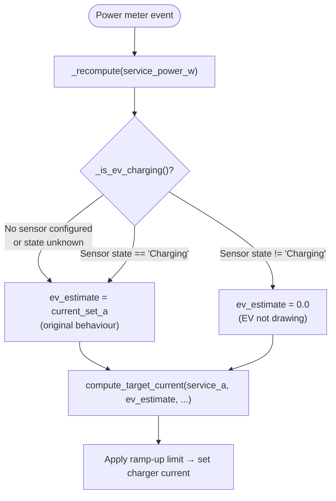
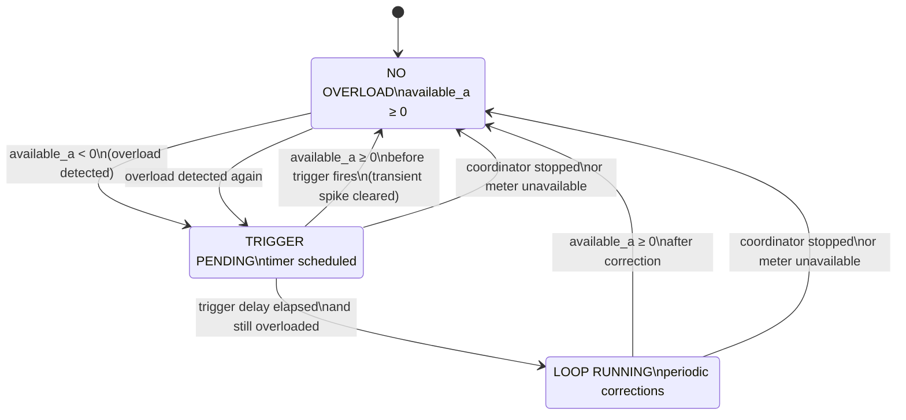

Title: Charger status sensor + overload correction loop
Date: 2026-02-25
Author: copilot
Status: in-review
Summary: Records design decisions, implementation details, and lessons learned from the PR that adds a charger status sensor and an overload correction timing loop to the load-balancing coordinator.

---

## Context

Two separate inaccuracies were identified in the original balancing algorithm:

1. **EV draw over-subtraction.** When the EV is idle, paused, or finished charging, the coordinator still subtracted the last commanded current from the household meter reading to estimate non-EV load. This caused the balancer to think more headroom was available than actually existed, delaying current reductions and producing a slightly inflated target once charging resumed.

2. **Overload not corrected between meter events.** If the power meter only reports a new value when its value changes (e.g., Zigbee smart meter with hysteresis), an overload that keeps the meter reading steady would never trigger a recomputation. The charger would remain at a current that exceeds the service limit until the next meter update.

Both problems were addressed in this PR.

---

## What was built

### 1. Charger status sensor (`CONF_CHARGER_STATUS_ENTITY`)

A new optional config key allows users to point the coordinator at an existing sensor entity (e.g., an OCPP `charger_status` sensor) that reports whether the EV is actively drawing current.

**`const.py`**
- `CONF_CHARGER_STATUS_ENTITY = "charger_status_entity"` — config key for the sensor entity ID.
- `CHARGING_STATE_VALUE = "Charging"` — the sensor state that indicates active draw; all other states are treated as not charging.

**`config_flow.py`**
- An optional `EntitySelector(domain="sensor")` field added to both the initial setup step and the options flow — consistent with how action scripts are configured and changeable after setup.

**`coordinator.py` — `_is_ev_charging()`**
- Reads the configured sensor state at recompute time.
- Returns `True` (assume charging) when: no sensor is configured, sensor state is `unknown`/`unavailable`, or sensor returns `None`.
- Returns `False` (EV not drawing) only when the sensor is configured and its state is something other than `"Charging"`.

**`coordinator.py` — `_recompute()`**
```python
ev_current_estimate = self.current_set_a if self._is_ev_charging() else 0.0
available_a, clamped = compute_target_current(
    service_current_a,
    ev_current_estimate,
    self._max_service_current,
    self.max_charger_current,
    self.min_ev_current,
)
```

When the EV is confirmed to not be drawing current, the estimate is zeroed out.  This means the full service capacity is considered available for non-EV household load isolation — the coordinator will not "give back" current that the charger is not using.

#### Charger status sensor data flow



---

### 2. Overload correction loop

When the household load pushes the service current above the breaker limit, the coordinator now reacts even if the power meter has not reported a new state value.

**`const.py`**
- `DEFAULT_OVERLOAD_TRIGGER_DELAY = 2.0` — overload must persist this many seconds before the first correction fires (prevents transient spikes from triggering unnecessary adjustments).
- `DEFAULT_OVERLOAD_LOOP_INTERVAL = 5.0` — while the overload persists, re-apply a correction every this many seconds.
- Validation limits added for both values.

**`number.py`** — two new Number entities
- `EvLbOverloadTriggerDelayNumber` — runtime-tunable delay (default 2 s, range 1–60 s, seconds).
- `EvLbOverloadLoopIntervalNumber` — runtime-tunable loop interval (default 5 s, range 1–60 s, seconds).

**`coordinator.py`** — new overload timer methods

| Method | Purpose |
|---|---|
| `_update_overload_timers()` | Called after every normal recompute. Starts the trigger timer if `available_a < 0` and no timer is running. Cancels all timers if `available_a >= 0`. |
| `_on_overload_triggered(now)` | Fires after the trigger delay. Calls `_force_recompute_from_meter()`, then starts the periodic loop if still overloaded. |
| `_overload_loop_callback(now)` | Fires every `overload_loop_interval_s`. Calls `_force_recompute_from_meter()`, then self-cancels if overload has cleared. |
| `_cancel_overload_timers()` | Cancels both the trigger and the loop. Called from `async_stop()` and when the meter becomes unavailable. |
| `_force_recompute_from_meter()` | Reads the current meter state directly and calls `_recompute()`. Skips gracefully if balancer is disabled, meter is unavailable, or reading is invalid. |

#### Overload correction loop state machine



#### Overload correction sequence

```mermaid
sequenceDiagram
    participant M as Power Meter
    participant C as Coordinator
    participant Timer as Trigger Timer
    participant Loop as Loop Timer

    M->>C: state_change (high load)
    C->>C: _recompute() → available_a = -4 A
    C->>Timer: async_call_later(2s, _on_overload_triggered)
    Note over C: Trigger pending — ignoring transients

    M-->>C: (no new state — meter value unchanged)

    Timer->>C: _on_overload_triggered()
    C->>C: _force_recompute_from_meter() → apply correction
    C->>Loop: async_track_time_interval(5s, _overload_loop_callback)

    loop Every 5 s while overloaded
        Loop->>C: _overload_loop_callback()
        C->>C: _force_recompute_from_meter() → apply correction
    end

    M->>C: state_change (load reduced)
    C->>C: _recompute() → available_a = +8 A
    C->>Loop: cancel loop
    C->>Timer: cancel trigger (if any)
```

---

### 3. Strings and translations

Labels added in `strings.json`, `translations/en.json`, and `translations/es.json`:

| Key | EN label | ES label |
|---|---|---|
| `charger_status_entity` (config/options) | `Charger status sensor` | `Sensor de estado del cargador` |
| `overload_trigger_delay` (number) | `Overload trigger delay` | `Retardo de activación por sobrecarga` |
| `overload_loop_interval` (number) | `Overload correction interval` | `Intervalo de corrección de sobrecarga` |

---

## Design decisions

### 1. Charger status sensor defaults to "charging" on uncertainty

When the sensor is absent, unavailable, or in an unknown state, the coordinator treats the EV as charging. This is the safe-side assumption — it may slightly over-subtract headroom (the original pre-sensor behaviour), but it will never under-subtract. Under-subtraction would mean the balancer thinks it can increase the charging current when it actually can't, risking an overload.

### 2. `CHARGING_STATE_VALUE = "Charging"` is a constant, not user-configurable

The value matches the OCPP charger status reported by the `homeassistant-ocpp` integration. Making it user-configurable would add complexity for little benefit in the MVP; other users can raise an issue if their charger reports a different value.

### 3. Trigger delay prevents transient-spike false positives

A power spike from a kettle or washing machine can push the service current briefly negative for < 1 second. Without the trigger delay, the overload loop would fire immediately on every spike, causing unnecessary charger adjustments and potentially triggering the ramp-up cooldown. The default 2-second trigger delay absorbs most transient spikes while still reacting to genuine sustained overloads within a comfortable time.

### 4. Loop runs independently of meter events

The periodic loop uses `async_track_time_interval` rather than waiting for the meter to report. This is intentional — if the meter updates only when its value changes (many Zigbee/Z-Wave smart meters have a reporting threshold), a sustained overload at the same Watt value would never generate a state change event, and the loop would never run. The time-based loop ensures corrections continue regardless of meter reporting frequency.

### 5. Both timing values are exposed as Number entities

Same pattern as `ramp_up_time` — users can tune them at runtime from the HA dashboard without touching the config entry. This is especially important during initial commissioning when users are trying to find the right values for their installation.

### 6. Overload timers are cancelled when meter becomes unavailable

If the power meter goes unavailable mid-overload, there's no valid Watt reading to base corrections on, so the loop would do nothing useful. Cancelling the timers avoids spurious no-op corrections and keeps the coordinator clean. The overload loop will restart automatically the next time a valid meter reading arrives and the overload is still present.

---

## Test coverage

### New tests in `test_balancing_engine.py`

**`TestChargerStatusSensor`** (4 tests):
- EV idle → `ev_estimate = 0` → balancer does not over-subtract headroom
- EV charging → `ev_estimate = current_set_a` → normal subtraction
- No sensor configured → original behaviour unchanged
- Status sensor configured via options flow (not initial data)

**`TestOverloadCorrectionLoop`** (5 tests):
- No timers created when available current is positive
- Trigger timer scheduled when overload detected
- Trigger fires → loop starts when still overloaded
- All timers cancelled when overload clears
- All timers cancelled on coordinator stop (integration unload)

### Entity count updates

Two new Number entities increased the per-entry entity count from 13 to 15. Updated in:
- `tests/test_entities.py` (device registration count + unique ID set)
- `tests/test_entity_initialization.py` (reload count)

All 288 tests pass.

---

## Lessons learned

- **Timer cleanup in `async_stop` is critical.** The first draft forgot to cancel the overload timers in `async_stop`. The test framework detected a "lingering timer" error, making it easy to catch. Always cancel all `async_call_later` and `async_track_time_interval` subscriptions in the teardown path.
- **Test isolation for fired callbacks.** The `test_overload_trigger_fires_and_starts_loop` test initially left a real timer behind by calling `_on_overload_triggered` without cancelling the pending one first. The fix: cancel the unsub before calling the callback directly, which correctly simulates the timer firing.
- **`_force_recompute_from_meter` should be guarded.** The initial implementation didn't check whether the balancer was disabled before reading the meter. Added the `if not self.enabled: return` guard early to keep behaviour consistent with `async_recompute_from_current_state`.

---

## What's next

- **Charger status state value** — consider making `CHARGING_STATE_VALUE` configurable if users report chargers that use different status strings (e.g., `"SuspendedEV"`, `"active"`).
- **Overload binary sensor** — the `available_current_a < 0` condition is computed in the coordinator but not exposed as a standalone `binary_sensor.*_overload` entity. Exposing it would allow users to build automations and alerts on overload events without relying on the `ev_lb_overload_stop` event (which only fires when charging actually stops). This is a natural follow-up entity.
- **Phase 2 multi-charger** — the overload loop structure will need to be adjusted for multi-charger setups where each charger has its own current limit and the water-filling algorithm runs across all chargers simultaneously.

---

## Changelog

- 2026-02-25: Initial version (PR implementation complete, 288 tests passing).
