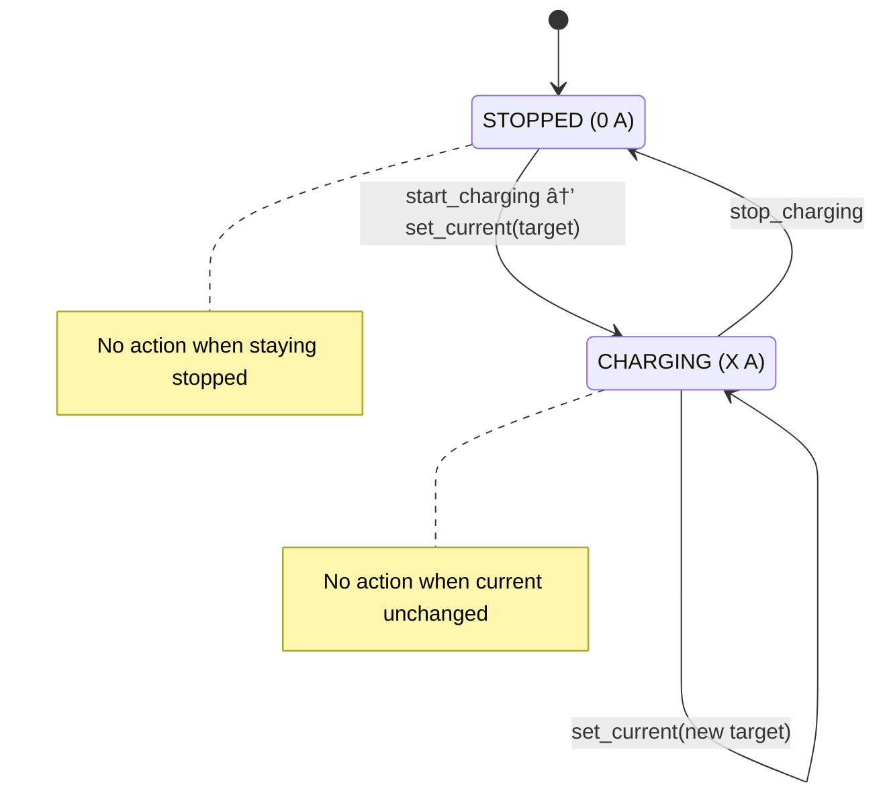

# Action Scripts Guide

This guide explains how to configure the **action scripts** that allow the EV Charger Load Balancing integration to control your physical charger.

## Overview

The integration computes the optimal charging current based on your household power consumption. To actually _control_ your charger, it needs scripts that translate these decisions into commands for your specific charger hardware (e.g., OCPP, Modbus, REST API, etc.).

```mermaid
flowchart LR
    LB["⚡ Load Balancer<br/>computes target current"] --> SC["📜 Your Scripts<br/>(set_current / stop / start)"]
    SC --> CH["🚗 Charger Hardware<br/>(OCPP / Modbus / REST / switch)"]

    style SC fill:#fff3cd,stroke:#856404
```



Three action scripts can be configured:

| Action | When it fires | Variables passed |
|---|---|---|
| **Set current** | When the target charging current changes | `current_a` (float), `current_w` (float), `charger_id` (string) |
| **Stop charging** | When headroom drops below the minimum and charging must stop | `charger_id` (string) |
| **Start charging** | When charging can resume after being stopped | `charger_id` (string) |

All actions are **optional**. If no scripts are configured, the integration operates in "compute-only" mode — it calculates and displays the target current via sensor entities, but does not send commands to any charger.

---

## Variables reference

Every script receives variables automatically. You can reference them in your script's action sequences using template syntax (e.g., `{{ current_a }}`).

### `set_current` script variables

| Variable | Type | Description | Example |
|---|---|---|---|
| `current_a` | `float` | Target charging current in Amps, floored to 1 A steps | `16.0` |
| `current_w` | `float` | Target charging power in Watts (`current_a × voltage`) | `3680.0` |
| `charger_id` | `string` | Unique identifier for the charger (config entry ID) | `abc123def456` |

### `stop_charging` script variables

| Variable | Type | Description | Example |
|---|---|---|---|
| `charger_id` | `string` | Unique identifier for the charger | `abc123def456` |

### `start_charging` script variables

| Variable | Type | Description | Example |
|---|---|---|---|
| `charger_id` | `string` | Unique identifier for the charger | `abc123def456` |

> **Note:** The `charger_id` is the Home Assistant config entry ID. In the current single-charger MVP it uniquely identifies the one configured charger. In a future multi-charger version, each charger will have its own ID.

---

## Creating scripts

### Step 1: Create the scripts in Home Assistant

Go to **Settings → Automations & Scenes → Scripts → + Add Script**.

#### Example: `set_current` script for OCPP

Create a script named `ev_lb_set_current`:

```yaml
alias: EV LB - Set Current
description: Set the EV charger current limit via OCPP
mode: single
fields:
  current_a:
    description: Target charging current in Amps
    example: 16.0
    selector:
      number:
        min: 0
        max: 80
        step: 1
        unit_of_measurement: A
  current_w:
    description: Target charging power in Watts
    example: 3680.0
    selector:
      number:
        min: 0
        max: 18400
        step: 1
        unit_of_measurement: W
  charger_id:
    description: Charger identifier
    example: "abc123"
    selector:
      text:
sequence:
  - action: ocpp.set_charge_rate
    data:
      limit_amps: "{{ current_a | int }}"
      conn_id: 1
```

#### Example: `stop_charging` script for OCPP

Create a script named `ev_lb_stop_charging`:

```yaml
alias: EV LB - Stop Charging
description: Stop EV charging via OCPP
mode: single
fields:
  charger_id:
    description: Charger identifier
    selector:
      text:
sequence:
  - action: ocpp.set_charge_rate
    data:
      limit_amps: 0
      conn_id: 1
```

#### Example: `start_charging` script for OCPP

Create a script named `ev_lb_start_charging`:

```yaml
alias: EV LB - Start Charging
description: Resume EV charging via OCPP
mode: single
fields:
  charger_id:
    description: Charger identifier
    selector:
      text:
sequence:
  - action: ocpp.set_charge_rate
    data:
      limit_amps: 6
      conn_id: 1
```

> **Tip:** The exact service calls depend on your charger integration. The examples above use the [lbbrhzn/ocpp](https://github.com/lbbrhzn/ocpp) integration. Replace the `ocpp.*` actions with whatever services your charger integration exposes.
>
> **OCPP note:** OCPP does not have a dedicated "start charging" command. The `start_charging` script above sets the minimum allowed current (6 A) as a signal to the charger to begin accepting current — the integration then calls `set_current` immediately after with the actual target. Adjust `conn_id` to match your charger's connector number (most single-connector chargers use `1`).

### Step 2: Configure in the integration

#### During initial setup

When adding the integration (Settings → Integrations → Add → EV Charger Load Balancing), you'll see optional fields for each action script. Select the scripts you created from the dropdown.

#### After initial setup (Options flow)

You can add, change, or remove action scripts at any time:

1. Go to **Settings → Integrations → EV Charger Load Balancing**.
2. Click **Configure**.
3. Update the action script selections.
4. Click **Submit**.

The integration will reload automatically with the new configuration.

---

## Transition logic

The integration tracks charger state and fires actions only when a transition occurs:



| Previous state | New state | Actions fired |
|---|---|---|
| **Stopped** (0 A) | **Charging** (> 0 A) | `start_charging` → `set_current(current_a, current_w)` |
| **Charging** (X A) | **Stopped** (0 A) | `stop_charging` |
| **Charging** (X A) | **Charging** (Y A, Y ≠ X) | `set_current(current_a, current_w)` |
| **Stopped** (0 A) | **Stopped** (0 A) | _(no action)_ |
| **Charging** (X A) | **Charging** (X A) | _(no action)_ |

### Resume sequence

When charging resumes after being stopped, `start_charging` is called **before** `set_current`. This ensures the charger is ready to accept current before a target is set. Both calls are `blocking: true`, so each script call waits for the **entire script** to finish executing before the next action is fired. This means if your `start_charging` script contains delays or multi-step sequences, `set_current` will not be called until they complete.

---

## Error handling

- **Script not configured:** The action is silently skipped. No error is logged.
- **Script call fails:** A warning is logged, an `ev_lb_action_failed` event is fired, and a persistent notification is created on the HA dashboard so you can see the problem at a glance. The integration continues operating — other actions are not affected. For example, if `start_charging` fails, `set_current` will still be attempted.
- **Script entity does not exist:** Treated as a call failure — a warning is logged, the event is fired, a persistent notification is created, and the integration continues.

---

## Can I use an action directly instead of a script?

Currently, the integration requires **script entities** (created in Settings → Automations & Scenes → Scripts). This was chosen because:

1. **Script entities provide a UI-friendly dropdown** — you pick from a list rather than typing service names and data manually.
2. **Scripts can contain multiple steps** — a single "set current" action might need to call multiple services, add delays, or include conditions.
3. **Scripts are reusable** — the same script can be called by automations, the integration, or manually from the Developer Tools.

Direct inline action configuration (like automation action sequences) may be considered for a future version. For now, creating scripts is the recommended approach and provides the same flexibility since scripts support all HA action types (service calls, delays, conditions, etc.).

---

## Adapting for different charger integrations

The scripts are the bridge between this integration and your specific charger. Here are some common patterns:

### OCPP chargers (lbbrhzn/ocpp)

The [lbbrhzn/ocpp](https://github.com/lbbrhzn/ocpp) integration exposes an `ocpp.set_charge_rate` service that sets a charging profile on the charger. All three actions are implemented using this single service.

**How OCPP charging control works:**

- Setting `limit_amps` to a positive value resumes or adjusts charging.
- Setting `limit_amps` to `0` pauses charging (the EVSE stops offering current to the car).
- There is no dedicated "start" command in OCPP — chargers start charging automatically when a positive limit is set and a car is connected.
- `conn_id` is the connector number. Most home chargers have one connector, so `conn_id: 1`. If your charger has multiple connectors, adjust accordingly.

**Finding your `conn_id`:**

Check your OCPP charger's device page in Home Assistant (**Settings → Devices & Services → OCPP → your charger**). The connector number is usually labelled or visible in the charger's entity names (e.g., `sensor.charger_current_import` vs `sensor.charger_2_current_import` for a second connector).

```yaml
# set_current — set the charging rate in amps
- action: ocpp.set_charge_rate
  data:
    limit_amps: "{{ current_a | int }}"
    conn_id: 1

# set_current — alternative: use watts if your charger prefers it
- action: ocpp.set_charge_rate
  data:
    limit_watts: "{{ current_w | int }}"
    conn_id: 1

# stop_charging — set limit to 0 to pause charging
- action: ocpp.set_charge_rate
  data:
    limit_amps: 0
    conn_id: 1

# start_charging — set minimum current to signal resume
# (set_current is called immediately after with the actual target)
- action: ocpp.set_charge_rate
  data:
    limit_amps: 6
    conn_id: 1
```

> **Why `limit_amps: 6` for start_charging?** OCPP does not have a dedicated "resume" command. Setting the minimum allowed current (6 A per IEC 61851) signals the charger to begin accepting current. The integration immediately calls `set_current` after `start_charging`, so the 6 A is replaced by the actual computed target within the same HA event-loop task.

> **Your script can contain any actions you need.** The example above is a minimal starting point. Since scripts support the full HA action syntax, you can add steps like toggling an enable/disable switch, calling a notify service, or adding a delay. Some chargers also require a hardware restart (e.g., `ocpp.reset`) to charge from a complete dead-stop — if that applies to yours, add it as the first step in your `start_charging` script. All three action scripts are optional, so only configure the ones your hardware requires.

> **Testing tip:** Before wiring up these scripts to the integration, test each one manually from **Developer Tools → Actions** by calling `script.turn_on` with the relevant variables (e.g., `variables: {current_a: 10, current_w: 2300, charger_id: test}`). Confirm your charger responds as expected.

### REST API chargers

```yaml
# set_current — use whichever unit your API requires
- action: rest_command.set_charger_current
  data:
    current: "{{ current_a }}"

# — or in watts:
- action: rest_command.set_charger_power
  data:
    power_w: "{{ current_w }}"

# stop_charging
- action: rest_command.stop_charger

# start_charging
- action: rest_command.start_charger
```

### Modbus chargers

```yaml
# set_current
- action: modbus.write_register
  data:
    hub: charger
    unit: 1
    address: 100
    value: "{{ (current_a * 10) | int }}"
```

### Generic switch-based chargers

```yaml
# stop_charging
- action: switch.turn_off
  target:
    entity_id: switch.ev_charger

# start_charging
- action: switch.turn_on
  target:
    entity_id: switch.ev_charger
```

> **Note:** For switch-based chargers, `set_current` may not be applicable if the charger doesn't support current limiting. In that case, only configure `stop_charging` and `start_charging`.

---

## Troubleshooting

### Actions are not firing

1. Check that the script entities exist in **Developer Tools → Services**.
2. Verify the scripts are selected in the integration config (Settings → Integrations → EV Charger Load Balancing → Configure).
3. Check the Home Assistant logs for warnings about failed actions.

### Actions fire but charger doesn't respond

1. Test the scripts manually from **Developer Tools → Services** by calling `script.turn_on` with the appropriate variables.
2. Verify your charger integration is working independently.
3. Check the charger integration's logs for errors.

### How to find the charger_id

The `charger_id` is the config entry ID, visible in the Home Assistant URL when you view the integration:
`/config/integrations/integration/ev_lb#<charger_id>`

You can also find it in **Developer Tools → States** by searching for any `ev_lb` entity and checking its `unique_id` prefix.
