# Development Guide

This guide is for contributors and developers who want to understand the integration's architecture, run tests locally, or contribute code.

---

## Architecture overview

### Repository structure

```
ha-ev-charger-balancer/
├── custom_components/ev_lb/     # The Home Assistant integration
│   ├── __init__.py              # Entry setup/unload, service registration
│   ├── _log.py                  # Logging wrapper
│   ├── binary_sensor.py         # Binary sensor entities (active, meter status, fallback)
│   ├── config_flow.py           # Config Flow UI (setup + options)
│   ├── const.py                 # Constants, defaults, validation limits
│   ├── coordinator.py           # Balancing coordinator (event handling, actions)
│   ├── load_balancer.py         # Pure computation functions (no HA dependency)
│   ├── manifest.json            # HA/HACS metadata
│   ├── number.py                # Number entities (max charger current, min EV current)
│   ├── sensor.py                # Sensor entities (current set, available, diagnostics)
│   ├── services.yaml            # Service definitions (ev_lb.set_limit)
│   ├── strings.json             # English UI strings
│   ├── switch.py                # Switch entity (load balancing enabled)
│   └── translations/            # Localized UI strings
├── tests/                       # Test suite
│   ├── conftest.py              # Shared fixtures
│   ├── test_load_balancer.py    # Pure-logic unit tests (39 tests)
│   ├── test_config_flow.py      # Config flow tests
│   ├── test_init.py             # Setup/unload tests
│   ├── test_logging.py          # Logging behavior tests
│   ├── test_set_limit_service.py # ev_lb.set_limit service tests
│   └── ...                      # Integration/e2e tests
├── docs/
│   ├── documentation/           # User-facing documentation
│   │   ├── user-manual.md       # Documentation index
│   │   ├── installation-and-setup.md
│   │   ├── how-it-works.md
│   │   ├── troubleshooting-and-debugging.md
│   │   ├── action-scripts-guide.md
│   │   ├── event-notifications-guide.md
│   │   ├── logging-guide.md
│   │   └── milestones/          # MVP plan, multi-charger plan
│   └── development-memories/    # Development artifacts (research, decisions, PR notes)
├── .github/                     # GitHub Actions workflows, dependabot, templates
├── pyproject.toml               # Ruff and codespell config
├── pyrightconfig.json           # Pyright type-checking config
└── pytest.ini                   # Pytest configuration
```

### Component interaction

```mermaid
flowchart TD
    PM["🔌 Power Meter<br/>(sensor entity)"] -->|state_changed event| CO["⚡ Coordinator<br/>(coordinator.py)"]
    NUM["🔢 Number Entities<br/>(max current, min current)"] -->|value changed| CO
    SW["🔘 Switch Entity<br/>(enabled/disabled)"] -->|toggled| CO
    SVC["🛠️ ev_lb.set_limit<br/>(service call)"] -->|manual override| CO

    CO -->|compute| LB["📐 Load Balancer<br/>(load_balancer.py)<br/>Pure functions, no HA dependency"]
    LB -->|target current| CO

    CO -->|dispatcher signal| SENS["📊 Sensor Entities<br/>(current set, available,<br/>state, reason)"]
    CO -->|dispatcher signal| BSENS["🔴🟢 Binary Sensors<br/>(active, meter status,<br/>fallback active)"]
    CO -->|script.turn_on| SCRIPTS["📜 Action Scripts<br/>(user-configured)<br/>set_current / stop / start"]
    CO -->|bus event| EVENTS["📢 HA Event Bus<br/>(ev_lb_* events)"]
    CO -->|create/dismiss| NOTIF["🔔 Persistent<br/>Notifications"]

    SCRIPTS -->|charger commands| CHARGER["🚗 EV Charger<br/>(OCPP / Modbus / REST / etc.)"]
```



### Key design decisions

- **Pure computation functions** (`load_balancer.py`) have no dependency on Home Assistant. They can be tested with plain pytest.
- **Coordinator pattern** (`coordinator.py`) — the coordinator subscribes to power-meter events and orchestrates the balancing loop. Entity platforms subscribe to dispatcher signals.
- **Action scripts** — the integration doesn't talk to chargers directly. Users configure HA scripts that translate commands to their specific charger hardware. This keeps the integration hardware-agnostic.
- **Single instance** — currently enforced via `async_set_unique_id(DOMAIN)`. Multi-charger support is planned for Phase 2.

For more on why a custom integration was chosen over AppDaemon or blueprints, see [`docs/development-memories/2026-02-19-lessons-learned.md`](../development-memories/2026-02-19-lessons-learned.md).

---

## Setting up a development environment

### Prerequisites

- Python 3.12+
- pip (or your preferred Python package manager)

### Install dependencies

```bash
# From the repository root
pip install -r tests/requirements.txt
```

This installs `pytest`, `pytest-homeassistant-custom-component`, and related packages.

---

## Running tests

### All tests

```bash
python -m pytest tests/ -v
```

### Pure-logic unit tests only (fastest — no HA dependency)

```bash
python -m pytest tests/test_load_balancer.py -v
```

These 39 tests cover the core computation functions: available current calculation, clamping, water-filling distribution, and ramp-up cooldown. They run in under 1 second.

### Config flow and integration tests

```bash
python -m pytest tests/test_config_flow.py tests/test_init.py -v
```

These use `pytest-homeassistant-custom-component` to simulate the HA config flow UI and entry setup/unload.

### Logging tests

```bash
python -m pytest tests/test_logging.py -v
```

### Service tests

```bash
python -m pytest tests/test_set_limit_service.py -v
```

---

## Running CI checks locally

The repository has several CI checks that run on every PR. Here's how to run them locally:

### Linting (Ruff)

```bash
pip install ruff
ruff check .
```

Ruff reads its configuration from `pyproject.toml`.

### Type checking (Pyright)

```bash
pip install pyright
pyright
```

Pyright reads its configuration from `pyrightconfig.json`.

### Spell checking (codespell)

```bash
pip install codespell
codespell
```

Codespell reads its configuration from `pyproject.toml`.

### Secret scanning (Gitleaks)

```bash
# macOS
brew install gitleaks
# or download from https://github.com/gitleaks/gitleaks/releases

gitleaks detect --source . --config .gitleaks.toml
```

To suppress a confirmed false positive, append `# gitleaks:allow` to that line. For path-level suppressions, add the path regex to `.gitleaks.toml`.

### Dependency Review

This check is GitHub-only and runs automatically on every pull request — no local tooling required.

---

## Contributing

### Code contributions

1. Fork the repository and create a branch.
2. Make your changes with tests.
3. Run the full test suite: `python -m pytest tests/ -v`
4. Run lint, type check, and spell check (see above).
5. Open a PR against the `main` branch.

### Documentation contributions

- All research, plans, and design docs go under `docs/development-memories/` with an ISO-date prefix: `YYYY-MM-DD-short-name.md`.
- User-facing docs go under `docs/documentation/`.
- Every PR should include a development memory file documenting the work done.

See [`docs/development-memories/README.md`](../development-memories/README.md) for the full convention.

### Code style

- **Ruff** enforces linting and formatting (configured in `pyproject.toml`).
- **Pyright** enforces type safety (configured in `pyrightconfig.json`).
- Named constants live in `const.py` — avoid magic numbers and strings.
- Functions should have docstrings explaining their purpose.
- Test docstrings describe observable user behavior, not implementation details.

---

## Project roadmap

### Phase 1 — MVP (complete)

The MVP delivers a fully functional single-charger integration installable via HACS. All milestones are complete:

| Milestone | Scope | Status |
|---|---|---|
| PR-1 | Integration scaffold + Config Flow | ✅ Done |
| PR-2 | Core entities and device linking | ✅ Done |
| PR-3 | Single-charger balancing engine | ✅ Done |
| PR-4 | Action execution contract | ✅ Done |
| PR-5-MVP | Event notifications | ✅ Done |
| PR-6-MVP | Manual override + observability | ✅ Done |
| PR-7-MVP | Test stabilization + HACS release readiness | ✅ Done |
| PR-8-MVP | User manual | ✅ Done |

See the full plan: [`docs/documentation/milestones/01-2026-02-19-mvp-plan.md`](milestones/01-2026-02-19-mvp-plan.md)

### Phase 2 — Multi-charger (planned)

Multi-charger support with per-charger prioritization and weighted current distribution.

| Milestone | Scope |
|---|---|
| PR-1-ph2 | Multi-charger data model |
| PR-2-ph2 | Weighted current distribution engine |
| PR-3-ph2 | Runtime charger management |
| PR-4-ph2 | Test stabilization + release |

See the full plan: [`docs/documentation/milestones/02-2026-02-19-multi-charger-plan.md`](milestones/02-2026-02-19-multi-charger-plan.md)

---

## Development artifacts

All research, design decisions, and PR retrospectives are documented under `docs/development-memories/`:

- [`2026-02-19-research-plan.md`](../development-memories/2026-02-19-research-plan.md) — original research and design decisions
- [`2026-02-19-lessons-learned.md`](../development-memories/2026-02-19-lessons-learned.md) — AppDaemon/blueprint evaluation and rejection rationale
- [`2026-02-19-testing-guide.md`](../development-memories/2026-02-19-testing-guide.md) — how to test the integration
- And one file per PR milestone documenting work done and decisions made
