# Event Notifications Guide

This guide explains how to use the **event notifications** fired by the EV Charger Load Balancing integration to build automations — for example, sending mobile push alerts when a fault condition occurs.

## Overview

The integration fires standard Home Assistant bus events when notable conditions occur. You can listen to these events in automations, scripts, or Node-RED and trigger any action — mobile notifications, flashing a light, logging to a file, etc.


Five event types are available:

| Event type | When it fires | Persistent notification |
|---|---|---|
| `ev_lb_meter_unavailable` | Power meter becomes unavailable and charging is stopped (stop mode) | ✅ Created |
| `ev_lb_overload_stop` | Household load exceeds the service limit and charging is stopped | ✅ Created |
| `ev_lb_fallback_activated` | Power meter becomes unavailable and fallback current is applied (set-current mode) | ✅ Created |
| `ev_lb_charging_resumed` | Charging resumes after being stopped | ❌ (dismisses overload notification) |
| `ev_lb_action_failed` | A charger action script fails | ❌ |

---

## Event payloads

Every event includes `entry_id` (the config entry ID) plus condition-specific fields.

### `ev_lb_meter_unavailable`

Fired when the power meter entity transitions to `unavailable` or `unknown` and the configured behavior is **stop**.

| Field | Type | Description |
|---|---|---|
| `entry_id` | string | Config entry ID |
| `power_meter_entity` | string | Entity ID of the power meter sensor |

### `ev_lb_overload_stop`

Fired when household load exceeds the service limit and the charger is stopped from an active charging state.

| Field | Type | Description |
|---|---|---|
| `entry_id` | string | Config entry ID |
| `previous_current_a` | float | Charging current before the stop (A) |
| `available_current_a` | float | Computed available headroom at the time of stop (A) |

### `ev_lb_fallback_activated`

Fired when the power meter becomes unavailable and the configured behavior is **set a specific current**.

| Field | Type | Description |
|---|---|---|
| `entry_id` | string | Config entry ID |
| `power_meter_entity` | string | Entity ID of the power meter sensor |
| `fallback_current_a` | float | Fallback current applied (A) |

### `ev_lb_charging_resumed`

Fired when charging resumes from a stopped state (0 A → > 0 A).

| Field | Type | Description |
|---|---|---|
| `entry_id` | string | Config entry ID |
| `current_a` | float | New charging current (A) |

### `ev_lb_action_failed`

Fired when a configured charger action script raises an error during execution.

| Field | Type | Description |
|---|---|---|
| `entry_id` | string | Config entry ID |
| `action_name` | string | Name of the failed action (`set_current`, `stop_charging`, or `start_charging`) |
| `entity_id` | string | Entity ID of the script that failed |
| `error` | string | Error message from the failed script call |

---

## Persistent notifications

For the three fault conditions (meter unavailable, overload, fallback), the integration also creates **persistent notifications** visible on the HA dashboard. These are automatically dismissed when the fault resolves:

```mermaid
flowchart LR
    F1["Meter unavailable<br/>(stop mode)"] --> N1["🔔 Notification created"]
    F2["Overload stop"] --> N2["🔔 Notification created"]
    F3["Fallback activated"] --> N3["🔔 Notification created"]

    N1 --> R1["Meter recovers → dismissed ✅"]
    N2 --> R2["Charging resumes → dismissed ✅"]
    N3 --> R3["Meter recovers → dismissed ✅"]
```



- **Meter unavailable / fallback** notifications are dismissed when the meter recovers (next valid power reading).
- **Overload** notification is dismissed when charging resumes.

No user action is needed to clear them.

---

## Automation examples

### Mobile notification on overload

Send a push notification to your phone when the charger is stopped due to an overload:

```yaml
automation:
  - alias: "EV charger overload alert"
    trigger:
      - platform: event
        event_type: ev_lb_overload_stop
    action:
      - action: notify.mobile_app_my_phone
        data:
          title: "EV Charger — Overload"
          message: >
            Charging stopped. Was {{ trigger.event.data.previous_current_a }} A,
            available headroom: {{ trigger.event.data.available_current_a }} A.
```

### Mobile notification on meter unavailable

```yaml
automation:
  - alias: "EV charger meter lost"
    trigger:
      - platform: event
        event_type: ev_lb_meter_unavailable
    action:
      - action: notify.mobile_app_my_phone
        data:
          title: "EV Charger — Meter Lost"
          message: >
            Power meter {{ trigger.event.data.power_meter_entity }} is
            unavailable. Charging has been stopped for safety.
```

### Mobile notification on charging resumed

```yaml
automation:
  - alias: "EV charger resumed"
    trigger:
      - platform: event
        event_type: ev_lb_charging_resumed
    action:
      - action: notify.mobile_app_my_phone
        data:
          title: "EV Charger — Resumed"
          message: >
            Charging resumed at {{ trigger.event.data.current_a }} A.
```

### Flash a light on fallback activation

```yaml
automation:
  - alias: "Flash light on EV fallback"
    trigger:
      - platform: event
        event_type: ev_lb_fallback_activated
    action:
      - action: light.turn_on
        target:
          entity_id: light.garage
        data:
          flash: short
```

### Combined alert for all fault events

```yaml
automation:
  - alias: "EV charger fault alert"
    trigger:
      - platform: event
        event_type: ev_lb_meter_unavailable
      - platform: event
        event_type: ev_lb_overload_stop
      - platform: event
        event_type: ev_lb_fallback_activated
    action:
      - action: notify.mobile_app_my_phone
        data:
          title: "EV Charger Alert"
          message: "Event: {{ trigger.event.event_type }}"
          data:
            push:
              sound: default
              badge: 1
```

### Mobile notification on action script failure

Send a push notification when a charger action script fails, so you can investigate broken scripts:

```yaml
automation:
  - alias: "EV charger action failed"
    trigger:
      - platform: event
        event_type: ev_lb_action_failed
    action:
      - action: notify.mobile_app_my_phone
        data:
          title: "EV Charger — Script Failed"
          message: >
            Action {{ trigger.event.data.action_name }} failed
            ({{ trigger.event.data.entity_id }}):
            {{ trigger.event.data.error }}
```

---

## Using events in Node-RED

If you use the [Node-RED companion integration](https://github.com/zachowj/hass-node-red), you can listen for these events with an **events: all** node filtered by event type (e.g., `ev_lb_overload_stop`). The event payload is available in `msg.payload.event`.

---

## Tips

- **Test manually:** You can trigger a test event from **Developer Tools → Events** by firing `ev_lb_overload_stop` with a sample payload to verify your automations work before a real fault occurs.
- **Filter by entry_id:** If you plan to use multi-charger support in the future, filter automations by `trigger.event.data.entry_id` to target a specific charger.
- **Combine with persistent notifications:** The integration already creates dashboard notifications for faults. Automations let you extend this to mobile alerts, Telegram, email, or any notification platform HA supports.
