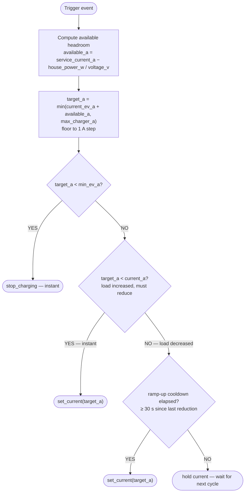
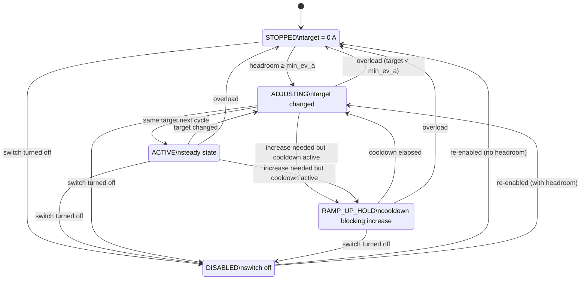
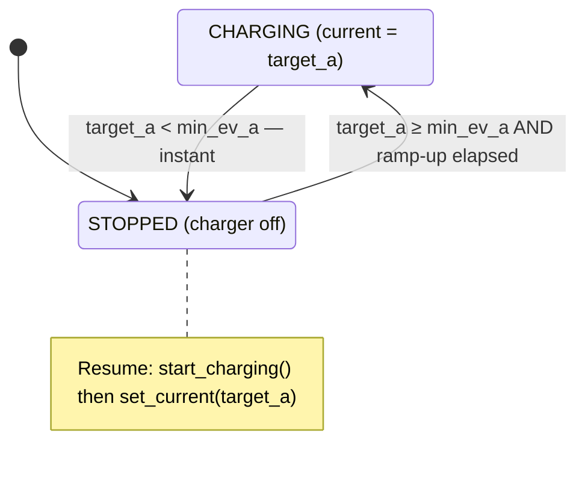
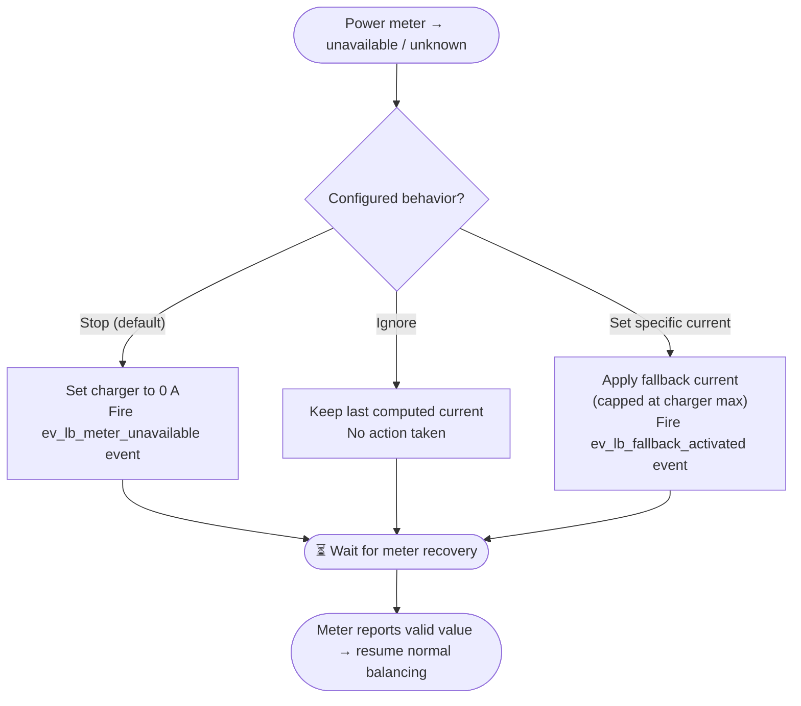
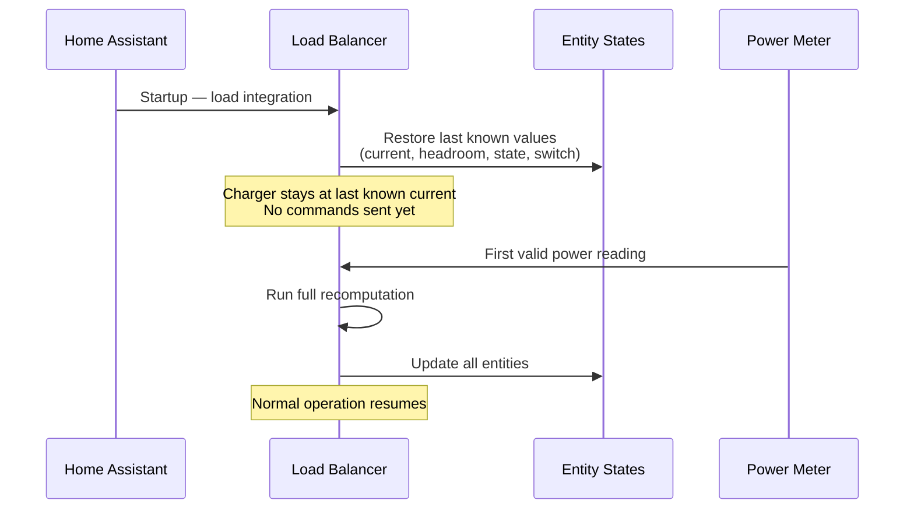
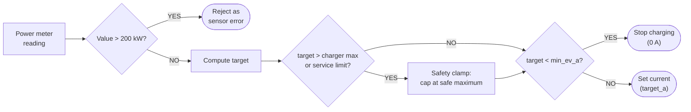

# How It Works

This guide explains what the integration does, what you can expect from it, what it does **not** do, and the technical details of how it balances your EV charger's current.

---

## The short version

The integration watches your home's power meter. When your total household power consumption changes, it instantly recalculates how much current your EV charger can safely use without exceeding your main breaker limit. If the load goes up, the charger current goes down — immediately. If the load goes down, the charger current goes back up — after a short cooldown to prevent oscillation.

That's it. It's a reactive, real-time load balancer for a single EV charger.

---

## What to expect

- **Automatic current adjustment.** You plug in your EV, and the integration continuously adjusts the charging current based on what the rest of your house is consuming. No manual intervention needed.
- **Safety-first behavior.** If something goes wrong (meter unavailable, overload), the default response is to stop or reduce charging immediately.
- **Dashboard visibility.** The integration creates several sensor entities so you can see exactly what it's doing — current being set, available headroom, balancer state, meter health — all visible in the HA dashboard.
- **Event notifications.** When faults occur (overload, meter lost, fallback activated), the integration fires HA events and creates persistent notifications. You can build automations on these to get mobile alerts.
- **State survives restarts.** All entity states are restored after a Home Assistant restart. The charger current stays at its last known value until fresh meter data arrives.

## What NOT to expect

- **This is not a charger driver.** The integration does not communicate directly with your charger hardware. It computes the optimal current and calls user-configured scripts to execute the commands. If your scripts are wrong or your charger integration is broken, the integration can't fix that.
- **This does not monitor charger health.** The integration has no way to know if your charger is physically connected, responding, or actually applying the current it's told to set. Charger health monitoring is the responsibility of your charger integration (e.g., OCPP).
- **This does not provide circuit-level protection.** The integration is a software load balancer. It is not a replacement for proper electrical protection (breakers, fuses, RCDs). Always ensure your electrical installation meets local codes.
- **This does not support multiple chargers yet.** The current version supports exactly **one charger**. Only one instance of the integration can be configured. Multi-charger support with per-charger prioritization is planned for [Phase 2](milestones/02-2026-02-19-multi-charger-plan.md).
- **This does not manage time-of-use tariffs or solar surplus directly.** The integration exclusively handles load balancing — it reacts to total metered power to prevent exceeding your service limit. However, it works well **alongside** external automations that handle these concerns. See [Combining with solar surplus or time-of-use tariffs](#combining-with-solar-surplus-or-time-of-use-tariffs) below.
- **Current adjustments are in 1 A steps.** The integration floors all current values to whole Amps. Sub-amp precision is not supported.
- **Increases are delayed.** After any current reduction, there's a 30-second cooldown (default, currently not configurable) before the integration allows the current to increase again. This is intentional — it prevents rapid oscillation when household load fluctuates near the service limit.

### Combining with solar surplus or time-of-use tariffs

The integration focuses exclusively on **load balancing** — ensuring your home never exceeds the service limit. It does not know about electricity prices, solar production, or battery state. However, you can easily combine it with automations that handle these concerns:

**Solar surplus charging:** Create a template sensor that calculates your available solar surplus in Amps, then use an automation to write that value to `number.*_max_charger_current`. The load balancer will use it as the upper limit and ensure the charger never exceeds your service limit on top of that.

```yaml
# Example: automation to set charger max from solar surplus
automation:
  - alias: "Set EV max current from solar surplus"
    trigger:
      - platform: state
        entity_id: sensor.solar_surplus_amps  # your template sensor
    action:
      - action: number.set_value
        target:
          entity_id: number.ev_charger_load_balancer_max_charger_current
        data:
          value: "{{ states('sensor.solar_surplus_amps') | float(0) | round(0) }}"
```

**Time-of-use tariffs:** Use an automation to toggle `switch.*_load_balancing_enabled` on/off based on the current tariff period, or adjust `number.*_max_charger_current` to a lower value during peak hours.

```yaml
# Example: disable charging entirely during peak hours
automation:
  - alias: "Disable EV charging during peak"
    trigger:
      - platform: time
        at: "17:00:00"
    action:
      - action: switch.turn_off
        target:
          entity_id: switch.ev_charger_load_balancer_load_balancing_enabled

  - alias: "Re-enable EV charging off-peak"
    trigger:
      - platform: time
        at: "21:00:00"
    action:
      - action: switch.turn_on
        target:
          entity_id: switch.ev_charger_load_balancer_load_balancing_enabled
```

```yaml
# Example: limit charging to 10 A during peak, full speed off-peak
automation:
  - alias: "Limit EV charging during peak"
    trigger:
      - platform: time
        at: "17:00:00"
    action:
      - action: number.set_value
        target:
          entity_id: number.ev_charger_load_balancer_max_charger_current
        data:
          value: 10

  - alias: "Full-speed EV charging off-peak"
    trigger:
      - platform: time
        at: "21:00:00"
    action:
      - action: number.set_value
        target:
          entity_id: number.ev_charger_load_balancer_max_charger_current
        data:
          value: 32
```

In both cases, the load balancer continues to protect your service limit — the external automation controls _when_ or _how much_ to charge, while the integration ensures you never exceed your breaker rating.

---

## Entities reference

All entities are grouped under a single device called **EV Charger Load Balancer** in **Settings → Devices**.

### Sensors

| Entity | Type | What it tells you |
|---|---|---|
| `sensor.*_charging_current_set` | Measurement (A) | The charging current the integration last sent to the charger. Shows `0` when charging is stopped. This is what your charger *should* be doing. |
| `sensor.*_available_current` | Measurement (A) | How much headroom your electrical service has for EV charging right now. Positive = room to charge. Negative = overloaded. |
| `sensor.*_last_action_reason` | Diagnostic | Why the last recomputation happened. Values: `power_meter_update` (normal), `manual_override`, `fallback_unavailable`, `parameter_change`. |
| `sensor.*_balancer_state` | Diagnostic | The integration's operational state right now — see [Balancer states](#balancer-states) below. |
| `sensor.*_configured_fallback` | Diagnostic | What the integration is configured to do when the meter goes unavailable: `stop`, `ignore`, or `set_current`. |

### Binary sensors

| Entity | Type | What it tells you |
|---|---|---|
| `binary_sensor.*_load_balancing_active` | — | **On** = the charger is being actively controlled (current > 0 A). **Off** = charger is stopped or idle. |
| `binary_sensor.*_power_meter_status` | Connectivity | **On** = your power meter is reporting valid readings. **Off** = meter is unavailable or unknown. |
| `binary_sensor.*_meter_fallback_active` | Problem | **On** = the meter is unavailable and a fallback behavior is in effect. **Off** = normal operation. |

### Number entities (adjustable at runtime)

| Entity | Range | What it controls |
|---|---|---|
| `number.*_max_charger_current` | 1–80 A | The maximum current your charger can handle. The integration will never set a current higher than this. Change it at runtime to temporarily limit charging. |
| `number.*_min_ev_current` | 1–32 A | The minimum current at which your charger can operate (IEC 61851 standard: 6 A for AC). If the computed target falls below this, charging stops entirely rather than running at an unsafe low current. |

### Switch

| Entity | What it controls |
|---|---|
| `switch.*_load_balancing_enabled` | Master on/off switch for the integration. When **off**, the integration ignores all power meter events and takes no action. The charger current stays at whatever was last set. Turn it back on to resume automatic balancing. |

### Service

| Service | What it does |
|---|---|
| `ev_lb.set_limit` | Manually override the charger current. Accepts `current_a` (float). The value is clamped to the charger's min/max range. If it falls below the minimum EV current, charging stops. **The override is one-shot** — the next power-meter event resumes automatic balancing. Useful for temporary limits via automations. |

---

## How the balancing algorithm works

### Simple version

Every time your power meter reports a new value:

1. **Calculate headroom:** How much current can you still use before hitting your main breaker limit?
   - Formula: `available_amps = max_service_current - (house_power_watts / voltage)`
2. **Calculate target:** What should the charger be set to?
   - Target = current charger setting + available headroom (capped at charger maximum)
3. **Apply safety rules:**
   - If target is below the minimum EV current → stop charging (instant)
   - If target is lower than current setting → reduce immediately (instant, no delay)
   - If target is higher than current setting → increase only after a cooldown period (default: 30 s, currently not configurable)

### Advanced details

The balancer is **event-driven** — it does not poll on a timer. A recomputation is triggered by any of these events:

| Trigger | What happens | Speed |
|---|---|---|
| **Power meter state change** | Sensor reports a new Watt value. The coordinator reads it and runs the full algorithm. | Instant — same HA event-loop tick. |
| **Max charger current changed** | User or automation changes the number entity. Coordinator re-reads the current meter value and recomputes. | Instant. |
| **Min EV current changed** | Same as above. If the new minimum is higher than the current target, charging stops immediately. | Instant. |
| **Load balancing re-enabled** | The switch is turned back on. Full recomputation using current meter value. | Instant. |

> **When load balancing is disabled** (switch is off), power-meter events are ignored. The charger current stays at its last value. No action is taken until the switch is turned back on.

#### The computation pipeline

On each trigger:

```
house_power_w = read power meter sensor
available_a   = service_current_a − house_power_w / voltage_v
raw_target_a  = current_ev_a + available_a
target_a      = min(raw_target_a, max_charger_a), floored to 1 A steps
```

Then the safety rules apply:



#### Why instant down, delayed up?

**Reductions are always instant** because safety comes first — if your household load spikes, the charger current must drop immediately to avoid exceeding your breaker limit.

**Increases are delayed by a cooldown period** (default: 30 seconds, currently not user-configurable) after any reduction because household loads often fluctuate. Without this cooldown, the charger would rapidly oscillate between high and low current every few seconds when load hovers near the service limit. The cooldown gives transient loads (kettles, microwaves, washing machine spin cycles) time to settle before ramping back up.

---

## Balancer states

The `sensor.*_balancer_state` diagnostic sensor tracks what the integration is doing at any moment:

| State | What it means | When you see it |
|---|---|---|
| `stopped` | Charger target is 0 A. | Overload, initial state, or available current is below minimum. |
| `active` | Charger is running at a steady current. | Normal operation — target hasn't changed since last cycle. |
| `adjusting` | Charger current just changed this cycle. | Load shifted and the integration adjusted the current. |
| `ramp_up_hold` | An increase is needed but the 30s cooldown hasn't elapsed yet. | Load dropped recently but a reduction happened within the last 30 s. |
| `disabled` | Load balancing switch is off. | User or automation turned off the switch. |



---

## Charger state transitions

From the charger's perspective, there are only two states: **charging** and **stopped**.



| Transition | What happens | Speed |
|---|---|---|
| **Charging → Stopped** | Target drops below minimum. `stop_charging` script is called. | Instant — no delay. |
| **Stopped → Charging** | Headroom rises above minimum and 30s cooldown has elapsed. `start_charging` is called first, then `set_current`. | After cooldown. |
| **Charging → Charging (different current)** | Target changed but still above minimum. `set_current` is called with the new target. | Reductions: instant. Increases: after cooldown. |

---

## Power meter unavailable

When your power meter sensor transitions to `unavailable` or `unknown`, the integration can no longer calculate headroom. What happens depends on your configured setting:



| Mode | What happens | Best for |
|---|---|---|
| **Stop charging** (default) | Charger is immediately set to 0 A. | Most users — if you can't measure, you can't safely balance. |
| **Ignore** | Nothing changes. Last computed current stays in effect. | Meters with frequent brief dropouts where interrupting charging is undesirable. |
| **Set a specific current** | Applies your configured fallback current, **always capped at the charger maximum.** If your fallback is 50 A but charger max is 32 A, it uses 32 A. | Users who want a safe-but-non-zero charging rate during meter outages. |

**When the meter recovers**, normal computation resumes automatically on the next valid reading. No user action needed.

> **Monitoring meter health:** Use `binary_sensor.*_power_meter_status` (On = healthy) and `binary_sensor.*_meter_fallback_active` (On = fallback in effect) in dashboards or automations to track meter reliability.

---

## Manual override

The `ev_lb.set_limit` service lets you temporarily override the automatic balancing:

```yaml
action: ev_lb.set_limit
data:
  current_a: 16
```

- The value is clamped to the charger's min/max range.
- If it falls below the minimum EV current, charging stops.
- **The override is one-shot** — the very next power-meter event resumes automatic balancing.

**Use case:** An automation that limits charging to 10 A during peak hours, then lets the balancer resume normal operation automatically when the meter next reports.

---

## Home Assistant restart behavior

All entity states survive a restart via Home Assistant's **RestoreEntity** mechanism:



1. Sensors restore their last known values (current set, available current, balancer state).
2. Number entities restore runtime parameters (max charger current, min EV current).
3. The switch restores its enabled/disabled state.
4. The coordinator waits for the first power-meter event before taking any action.

> **Between restart and the first meter event**, the charger current stays at whatever it was before the restart. No commands are sent until fresh meter data arrives. This avoids unnecessary spikes or drops on startup.

---

## Safety guardrails

The integration includes several defense-in-depth safety measures:



| Guardrail | What it does |
|---|---|
| **Instant reductions** | Current is reduced immediately when load increases — no delay. |
| **Default stop on meter unavailable** | If the meter goes offline, the safest default is to stop charging (0 A). |
| **Power reading sanity check** | Meter values above 200 kW (200,000 W) are rejected as sensor errors and ignored. |
| **Fallback current cap** | The fallback current is always capped at the charger maximum — even a misconfigured fallback can't exceed the physical charger limit. |
| **Output safety clamp** | A defense-in-depth clamp ensures the output never exceeds the charger maximum or service limit, even if there's a bug in the computation logic. |

> ⚠️ **This integration is provided as-is without warranty.** It is a software load balancer, not a substitute for proper electrical protection. Always audit the code and test with your specific hardware before relying on it in production.

---

## Next steps

- Having issues? See [Troubleshooting & Debugging](troubleshooting-and-debugging.md)
- Want mobile alerts? See [Event Notifications Guide](event-notifications-guide.md)
- Need to set up charger scripts? See [Action Scripts Guide](action-scripts-guide.md)
- Want to contribute? See the [Development Guide](development-guide.md)
