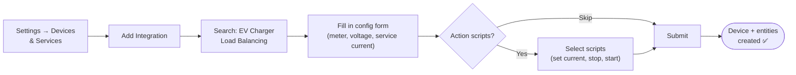

# Installation & Setup

This guide walks you through installing the integration, configuring it for the first time, and verifying that everything is working.

---

## Prerequisites

Before you begin, make sure you have:

- **Home Assistant 2023.6 or later** (Core, OS, or Container install)
- **[HACS](https://hacs.xyz/) 2.0 or later** for installing the integration
- **A power meter sensor** — any `sensor.*` entity in Home Assistant that reports your total household power consumption in Watts
- **An EV charger you can control** — via [lbbrhzn/ocpp](https://github.com/lbbrhzn/ocpp), Modbus, REST API, or any charger controllable through Home Assistant scripts

> **Don't have a controllable charger?** The integration can still run in "compute-only" mode — it calculates the optimal charging current and exposes it as a sensor, but does not send any commands. You can use this to test, prototype dashboards, or build your own automations around the computed value.

---

## Installation

### Via HACS (recommended)

1. Open **HACS → Integrations → ⋮ (three dots) → Custom repositories**.
2. Add `https://github.com/alexisml/ha-ev-charger-balancer` as an **Integration**.
3. Search for **Watt-O-Balancer** and click **Download**.
4. **Restart Home Assistant** — the integration won't appear until you restart.

### Manual installation

1. Download or clone this repository.
2. Copy the `custom_components/ev_lb/` folder into your Home Assistant `config/custom_components/` directory.
3. **Restart Home Assistant.**

After installation, the integration is available in **Settings → Devices & Services → Add Integration**.

---

## Configuration

### Step-by-step initial setup

1. Go to **Settings → Devices & Services → Add Integration**.
2. Search for **Watt-O-Balancer** and select it.
3. You'll see a configuration form. Here's what each field means:

#### Required fields

| Field | What it is | What to enter | Default |
|---|---|---|---|
| **Power meter sensor** | The sensor that reports your total household power consumption in Watts. This is the main input the integration uses to compute available headroom. | Select any `sensor.*` entity that reports power in W. This is typically your main electricity meter, a CT clamp sensor, or a smart meter integration. | *(required — no default)* |
| **Supply voltage** | Your nominal mains voltage. Used to convert between Watts and Amps. | Enter `230` for most of Europe, `240` for UK/Australia, or `120` for North America. | `230` V |
| **Max service current** | Your whole-house breaker rating (main fuse). The integration will **never** allow total consumption to exceed this. | Check your main breaker or electrical panel. Common values: 25 A, 32 A, 40 A, 63 A. | `32` A |
| **When power meter is unavailable** | What should happen if your power meter sensor stops reporting (goes `unavailable` or `unknown`). | Choose one of three options — see below. | `Stop charging` |

#### Unavailable behavior options

| Option | What it does | When to use it |
|---|---|---|
| **Stop charging** (default) | Immediately sets charger current to 0 A. Safest option. | Recommended for most users. If you can't measure power, you can't safely balance. |
| **Ignore (keep last value)** | Keeps the last computed charging current unchanged. | If your meter has frequent brief dropouts and you don't want charging interrupted every time. |
| **Set a specific current** | Applies a fixed fallback current (configured below), capped at the charger maximum. | If you want a safe-but-non-zero charging rate as a fallback. |

| Field | What it is | Default |
|---|---|---|
| **Fallback current** | The current to use when meter is unavailable and mode is "Set a specific current". Always capped at the charger maximum — even if you enter 50 A and your charger max is 32 A, it will use 32 A. | `6` A |

#### Optional fields — action scripts

These are **optional**. If you skip them, the integration runs in compute-only mode (sensors only, no charger commands).

| Field | What it does |
|---|---|
| **Set current action** | A script entity that the integration calls to set the charging current on your charger. Receives `current_a` (float) and `charger_id` (string) as variables. |
| **Stop charging action** | A script entity called to stop charging when there's not enough headroom. Receives `charger_id` (string). |
| **Start charging action** | A script entity called to resume charging after it was stopped. Receives `charger_id` (string). |

> **New to action scripts?** See the [Action Scripts Guide](action-scripts-guide.md) for step-by-step instructions on creating scripts for OCPP, REST, Modbus, or switch-based chargers.

4. Click **Submit**. The integration creates a device called **EV Charger Load Balancer** and all its entities immediately.

### Changing settings after setup

Almost all settings can be changed at any time via the **Configure** dialog — no need to delete and re-add the integration.

#### What you can change

1. Go to **Settings → Devices & Services → Watt-O-Balancer**.
2. Click the **Configure** button (gear icon).
3. Adjust any of the following and click **Submit**. The integration reloads automatically.

| Setting | Changeable via Configure? |
|---|---|
| Supply voltage | ✅ Yes |
| Max service current | ✅ Yes |
| When power meter is unavailable | ✅ Yes |
| Fallback current | ✅ Yes |
| Set current action script | ✅ Yes |
| Stop charging action script | ✅ Yes |
| Start charging action script | ✅ Yes |
| **Power meter sensor** | ❌ **No** — see below |

#### Changing the power meter sensor

The power meter sensor **cannot** be changed after setup. It acts as the unique identifier for the config entry — Home Assistant uses it internally to prevent duplicate instances and to track the integration across restarts.

To switch to a different power meter sensor, you must **delete the integration and re-add it**:

1. Go to **Settings → Devices & Services → Watt-O-Balancer**.
2. Click the three dots (⋮) → **Delete**.
3. Add the integration again and select the new sensor during setup.

---

## Verifying your setup

After configuration, check that everything is working:

1. **Go to Settings → Devices → EV Charger Load Balancer.** You should see all entities listed under this device.

2. **Check the key sensors:**
   - `sensor.*_available_current` — should show a value in Amps (this is how much headroom your electrical service has for EV charging right now).
   - `sensor.*_balancer_state` — should show `stopped` (if available current is below minimum) or `active`/`adjusting` (if there's enough headroom).
   - `binary_sensor.*_power_meter_status` — should be **On** (meter is reporting data).

3. **Test the reaction:** If you have action scripts configured, try changing your household load (turn on a high-power appliance like a kettle or oven) and watch the `sensor.*_charging_current_set` value change in real time.

> **Tip:** You can also check **Developer Tools → States** and filter by `ev_lb` to see all entity states at a glance.

---

## Removing the integration

1. Go to **Settings → Devices & Services → Watt-O-Balancer**.
2. Click the three dots (⋮) → **Delete**.
3. All entities and the device are removed. Your charger is left at whatever current was last set — the integration does not send a "reset" command on removal.

---

## Next steps

- Learn [how the integration works](how-it-works.md) — what to expect, what it does and doesn't do
- Set up [action scripts](action-scripts-guide.md) to control your physical charger
- Configure [event notifications](event-notifications-guide.md) for mobile alerts
