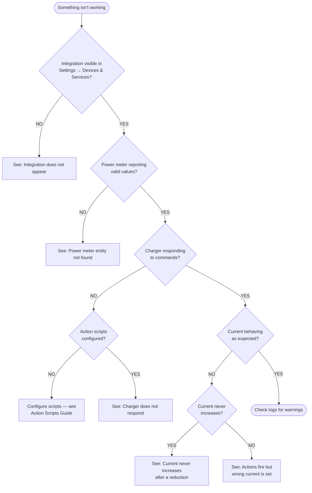

# Troubleshooting & Debugging

This guide helps you diagnose problems, understand what the integration is doing, and report issues effectively.

---

## Quick checklist

Before diving into specifics, run through this checklist:

- [ ] Is the integration loaded? Check **Settings → Devices & Services** — do you see "Watt-O-Balancer"?
- [ ] Is the power meter sensor reporting valid values? Check **Developer Tools → States** and search for your meter entity.
- [ ] Is load balancing enabled? Check `switch.*_load_balancing_enabled` — is it **On**?
- [ ] Are your action scripts working independently? Test them from **Developer Tools → Services**.
- [ ] Check **Settings → System → Logs** for any warnings or errors mentioning `ev_lb`.

---

## Common problems

Use this flowchart to quickly identify the most likely cause:



### The integration does not appear in Add Integration

**Symptoms:** You search for "Watt-O-Balancer" in Add Integration but nothing comes up.

**Causes and fixes:**
1. **Integration not installed.** Verify the `custom_components/ev_lb/` folder exists in your HA config directory (usually `/config/custom_components/ev_lb/`).
2. **Home Assistant not restarted.** Custom integrations are only discovered after a restart. Go to **Settings → System → Restart**.
3. **Installation error.** Check **Settings → System → Logs** for any errors mentioning `ev_lb` or `custom_components`.

### "Already configured" error

**Symptoms:** When trying to add the integration, you see "Watt-O-Balancer is already configured."

**Cause:** The integration supports only one instance. It's already set up.

**Fix:** Go to **Settings → Devices & Services** and look for the existing instance. If you need to reconfigure it, delete it first, then add it again.

### Power meter entity not found

**Symptoms:** During setup, you select a power meter sensor but get an "entity not found" error.

**Causes and fixes:**
1. The entity doesn't exist yet — it may not have loaded. Wait for it to appear in **Developer Tools → States**.
2. You selected a non-sensor entity. The integration requires a `sensor.*` entity.
3. The entity was removed or renamed. Check your meter integration.

### Charger does not respond to commands

**Symptoms:** The integration is running and sensors show changing values, but your charger doesn't actually change its current.

**Steps to diagnose:**
1. **Check if scripts are configured.** Go to **Settings → Devices & Services → Watt-O-Balancer → Configure**. Are the action script fields filled in?
2. **Test scripts independently.** Go to **Developer Tools → Services**, search for your script (e.g., `script.ev_lb_set_current`), provide test variables (`current_a: 10`, `charger_id: test`), and run it. Does the charger respond?
3. **Check for warnings.** Look in **Settings → System → Logs** for messages like `Action set_current failed via script.*`.
4. **Verify your charger integration.** The problem may be in your charger integration (OCPP, Modbus, etc.), not in this integration. Test the charger integration independently.

### Current never increases after a reduction

**Symptoms:** After household load drops, the charger current stays low and doesn't ramp back up.

**Cause:** This is usually the ramp-up cooldown working as designed. After any reduction, the integration waits **30 seconds** before allowing increases. This prevents oscillation.

**What to check:**
1. Wait at least 30 seconds after the last reduction.
2. Check `sensor.*_balancer_state` — if it shows `ramp_up_hold`, the cooldown is active.
3. After the cooldown, the current should increase on the next power-meter event.

### Sensors show "unavailable" after restart

**Symptoms:** After a Home Assistant restart, the integration's sensors show "unavailable" instead of their previous values.

**Causes:**
1. **Integration failed to load.** Check **Settings → System → Logs** for errors.
2. **Config entry was removed.** Re-add the integration.
3. **First-time issue.** On the very first startup (no previous state to restore), sensors may briefly show unavailable until the first power-meter event arrives.

### Actions fire but the wrong current is set

**Symptoms:** The charger receives a current command, but the value is wrong.

**Check:**
1. Verify the `current_a` variable is used correctly in your script. The integration passes it as a float in Amps (e.g., `16.0`).
2. Some charger integrations expect different units — e.g., tenths of Amps (multiply by 10 in your script) or milliamps (multiply by 1000).
3. Make sure you're using `{{ current_a }}` (Jinja2 template syntax) in your script's YAML, not a hardcoded value.

### Load balancing seems to do nothing

**Symptoms:** The integration is installed and configured, but the charger current never changes.

**Check:**
1. Is `switch.*_load_balancing_enabled` turned **On**?
2. Is the power meter reporting values? Check `binary_sensor.*_power_meter_status`.
3. Is the available current above the minimum EV current? Check `sensor.*_available_current` — if it's below `number.*_min_ev_current`, the charger will stay stopped.
4. Are action scripts configured? Without scripts, the integration only computes — it doesn't send commands.

---

## Understanding the logs

### Enabling debug logs

Add to your `configuration.yaml`:

```yaml
logger:
  default: warning
  logs:
    custom_components.ev_lb: debug
```

Restart Home Assistant. Debug logs appear in **Settings → System → Logs**.

To go back to normal logging, change `debug` to `info` or remove the entry.

### What to expect at each log level

**INFO** (default) — very quiet, only major state changes:
```
INFO  Charging started at 18.0 A
INFO  Charging stopped (was 18.0 A, reason=power_meter_update)
```
You'll only see messages when charging starts or stops. Normal current adjustments are silent at this level.

**DEBUG** — full computation pipeline on every meter event:
```
DEBUG Recompute (power_meter_update): house=3000 W, available=19.0 A, raw_target=19.0 A, clamped=18.0 A, final=18.0 A
```
This tells you exactly what the integration computed: house power, available headroom, raw target, clamped target, and final output.

When the ramp-up cooldown is blocking an increase:
```
DEBUG Ramp-up cooldown holding current at 17.0 A (target 32.0 A)
```

When load balancing is disabled:
```
DEBUG Power meter changed but load balancing is disabled — skipping
```

Manual override via `ev_lb.set_limit`:
```
DEBUG Manual override: requested=20.0 A, clamped=20.0 A
```

**WARNING** — problems that need your attention:
```
WARNING Could not parse power meter value: not_a_number
WARNING Power meter sensor.house_power is unavailable — stopping charging (0 A)
WARNING Action set_current failed via script.ev_set_current: Service not found
```

### How log levels relate to the balancer lifecycle

```mermaid
flowchart LR
    A["Meter event<br/>(every few seconds)"] -->|DEBUG| B["Full computation<br/>pipeline logged"]
    B --> C{"State change?"}
    C -- "YES<br/>(start/stop)" -->|INFO| D["Transition logged"]
    C -- "NO" --> E["Silent at INFO"]
    B --> F{"Problem?"}
    F -- "YES" -->|WARNING| G["Fault logged<br/>(parse error, unavailable,<br/>action failure)"]
    F -- "NO" --> E
```

### Reading a debug log line

Here's how to interpret a typical debug log entry:

```
Recompute (power_meter_update): house=3000 W, available=19.0 A, raw_target=19.0 A, clamped=18.0 A, final=18.0 A
```

| Field | Meaning |
|---|---|
| `power_meter_update` | Trigger: a new meter reading arrived |
| `house=3000 W` | Total household power consumption right now |
| `available=19.0 A` | Headroom: `service_current - (house_power / voltage)` |
| `raw_target=19.0 A` | Current charger setting + available headroom |
| `clamped=18.0 A` | Raw target capped at charger max and floored to 1 A |
| `final=18.0 A` | After ramp-up cooldown check — this is what gets sent to the charger |

If `final` ≠ `clamped`, the ramp-up cooldown is holding the current.

---

## Using diagnostic sensors instead of logs

You don't need to enable debug logs for basic monitoring. These sensors give you real-time insight:

| Sensor | What it answers |
|---|---|
| `sensor.*_balancer_state` | What is the balancer doing right now? (`stopped`, `active`, `adjusting`, `ramp_up_hold`, `disabled`) |
| `sensor.*_configured_fallback` | What fallback did I configure? (`stop`, `ignore`, `set_current`) |
| `sensor.*_last_action_reason` | Why did the last update happen? (`power_meter_update`, `manual_override`, `fallback_unavailable`, `parameter_change`) |
| `sensor.*_last_action_status` | Did the last charger command succeed? (`success` / `failure`) |
| `sensor.*_last_action_error` | What went wrong? (error message from the last failed action, empty on success) |
| `sensor.*_last_action_timestamp` | When did the last charger command finish? (ISO 8601 timestamp) |
| `sensor.*_action_latency` | How long did the last charger command take? (wall-clock ms including retries) |
| `sensor.*_retry_count` | How many retries were needed? (`0` = first-try success) |
| `binary_sensor.*_power_meter_status` | Is my meter working? (On = yes, Off = no) |
| `binary_sensor.*_meter_fallback_active` | Is a fallback currently active? (On = yes, Off = no) |

**Dashboard tip:** Create a Mushroom-style card or entities card with these sensors to see the integration's status at a glance without opening logs.

---

## Event notifications for monitoring

The integration fires HA events for fault conditions. Use these in automations for proactive monitoring:

| Event | When it fires |
|---|---|
| `ev_lb_meter_unavailable` | Power meter went offline (stop mode) |
| `ev_lb_overload_stop` | Charging stopped due to overload |
| `ev_lb_fallback_activated` | Fallback current applied (meter unavailable, set-current mode) |
| `ev_lb_charging_resumed` | Charging resumed after being stopped |
| `ev_lb_action_failed` | A charger action script failed |

See the [Event Notifications Guide](event-notifications-guide.md) for payloads and automation examples.

---

## Reporting an issue

When filing a bug report on [GitHub](https://github.com/alexisml/ha-ev-charger-balancer/issues), include:

1. **Home Assistant version** (Settings → About).
2. **Integration version** (Settings → Devices & Services → Watt-O-Balancer → version).
3. **Debug logs** covering the problem (see [Enabling debug logs](#enabling-debug-logs) above).
4. **Entity states** at the time of the issue (screenshot from Developer Tools → States, filtered by `ev_lb`).
5. **Your configuration** — power meter entity, voltage, service current, unavailable behavior, action scripts.
6. **Steps to reproduce** — what you did, what you expected, what happened instead.

---

## FAQ

### Can I use this without a physical charger?

Yes. Without action scripts configured, the integration runs in "compute-only" mode. It calculates and displays the target current via sensor entities, which you can use in your own automations or dashboards.

### Does it work with solar/battery systems?

Yes, as long as you have a sensor reporting total household power in Watts. The integration does not differentiate between grid, solar, or battery power — it uses the total metered value to compute headroom.

If you want to charge only from solar surplus, create a template sensor that subtracts solar production from grid import and use that as the power meter input.

### What happens during a Home Assistant restart?

All entity states are restored. The coordinator defers all meter evaluation until `EVENT_HOMEASSISTANT_STARTED` fires (i.e., after every integration has loaded). Once HA is fully started:

- If the power meter is **healthy**: the integration waits for the first meter reading and then resumes normal operation.
- If the power meter is **unavailable**: the configured fallback is applied immediately (stop charging, ignore, or set a specific current).

This ensures that integrations providing the power meter (energy monitors, DSMR readers, etc.) have had time to connect before the load balancer evaluates the meter state.

See [How It Works — Restart behavior](how-it-works.md#home-assistant-restart-behavior).

### How fast does it react to load changes?

The balancer is event-driven and reacts on the same HA event-loop tick as the power-meter state change. In practice this means sub-second response for reductions. Increases are subject to the 30-second ramp-up cooldown.

### Can I change the ramp-up cooldown time?

Yes. The ramp-up cooldown defaults to 30 seconds and is adjustable via `number.*_ramp_up_cooldown` in the entity dashboard. The allowed range is 5–300 seconds. Lower values respond faster but risk oscillation on spiky loads; 20–30 s is recommended for most installations.

### Can I use multiple chargers?

Not yet. The current version supports one charger per instance, and only one instance is allowed. Multi-charger support with per-charger prioritization is planned for Phase 2. See the [multi-charger plan](milestones/02-2026-02-19-multi-charger-plan.md).

### Does it support three-phase (multi-phase) installations?

The integration assumes a single-phase supply for all Watt ↔ Amp conversions. It works correctly for single-phase chargers on single-phase services. For three-phase chargers or mixed setups, the single-phase formula may give incorrect results. Workarounds using template sensors are available — see [Single-phase assumption and multi-phase installations](how-it-works.md#single-phase-assumption-and-multi-phase-installations) for detailed guidance, examples, and important caveats.

### Is it safe?

The integration prioritizes safety with multiple guardrails (instant reductions, default stop on meter unavailable, sanity checks on power readings, output clamping). However, it is provided **as-is** without warranty. It is a software load balancer, not a replacement for proper electrical protection. Always audit the code and test with your hardware before relying on it.

### Where can I report bugs or request features?

Open an issue at [github.com/alexisml/ha-ev-charger-balancer/issues](https://github.com/alexisml/ha-ev-charger-balancer/issues). See [Reporting an issue](#reporting-an-issue) above for what to include.
